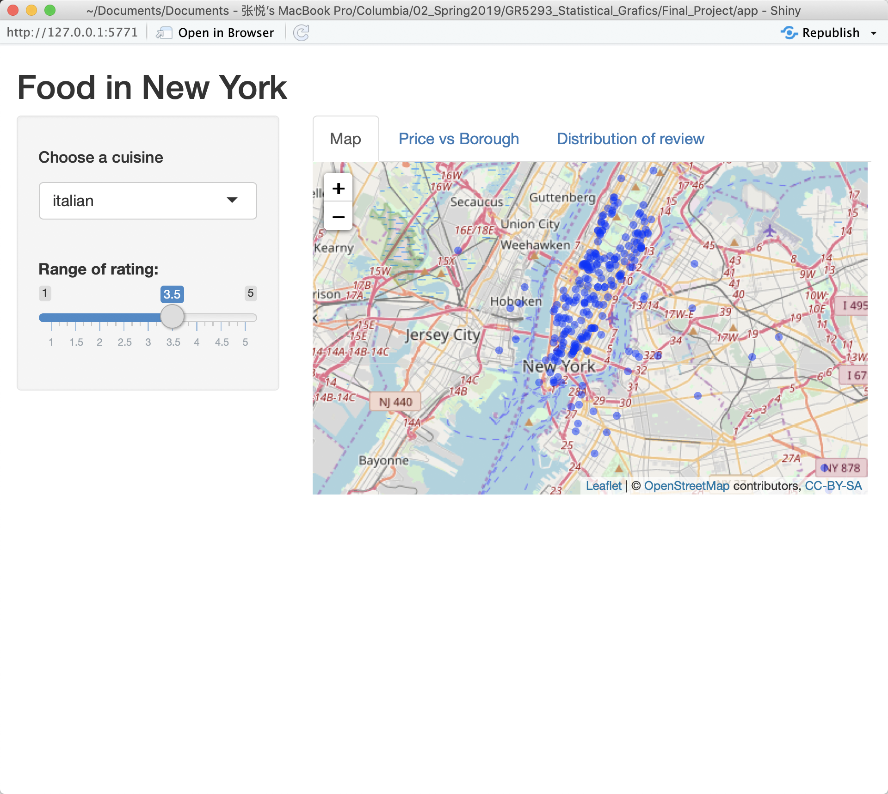
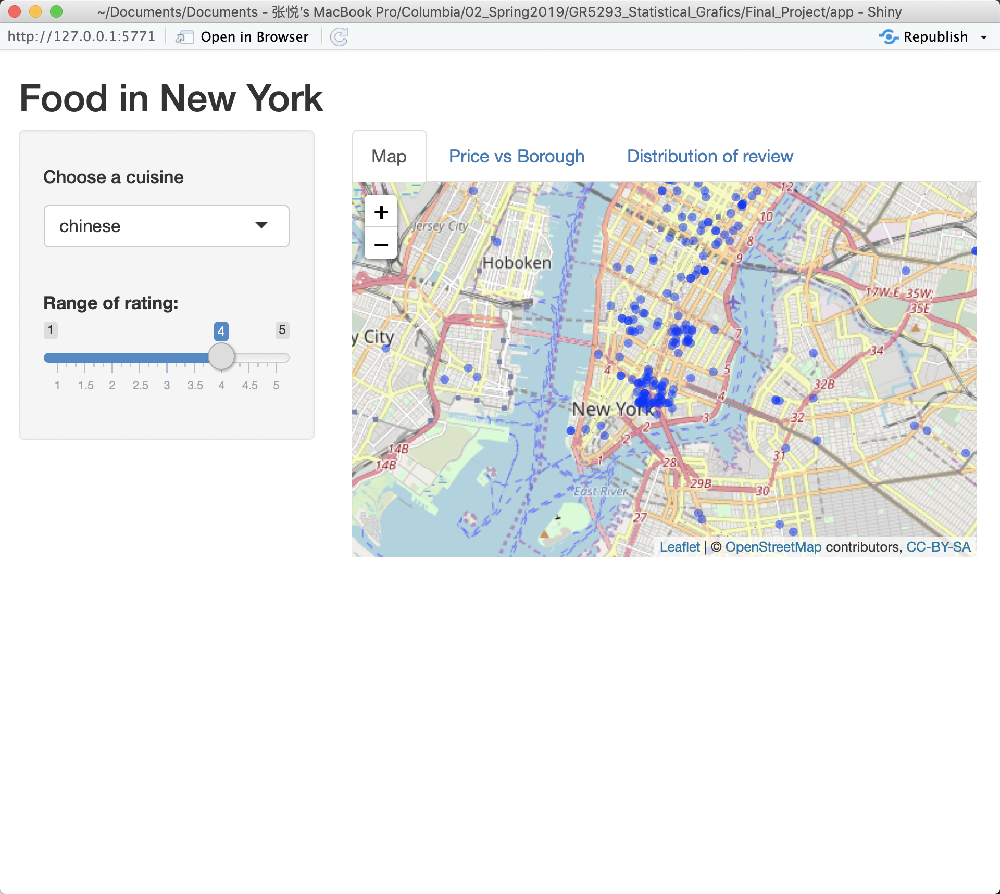
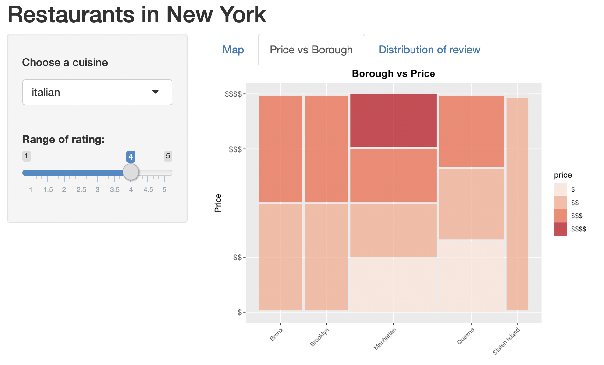
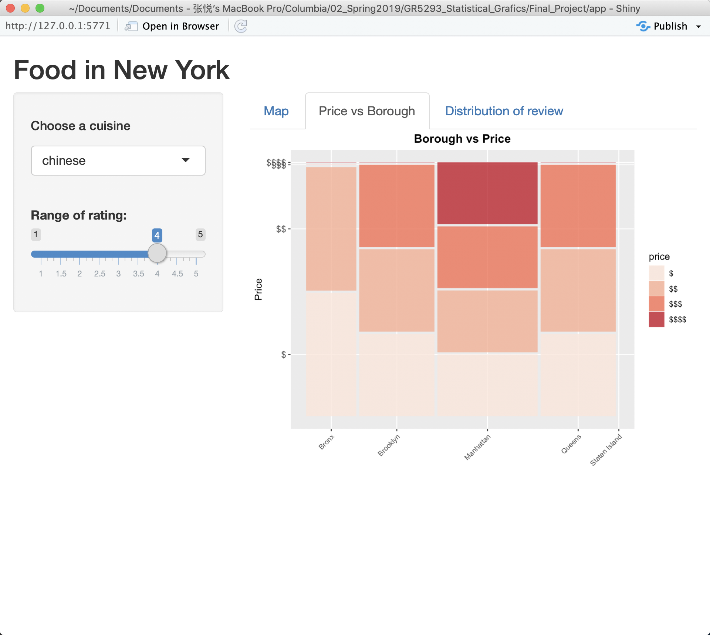
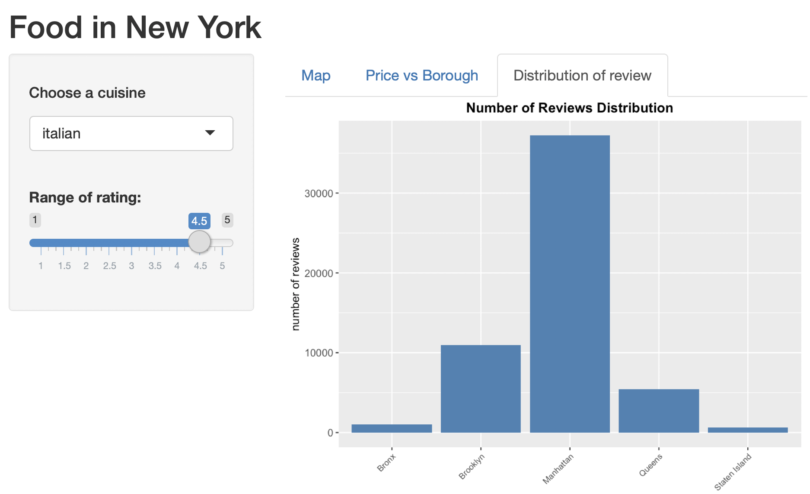
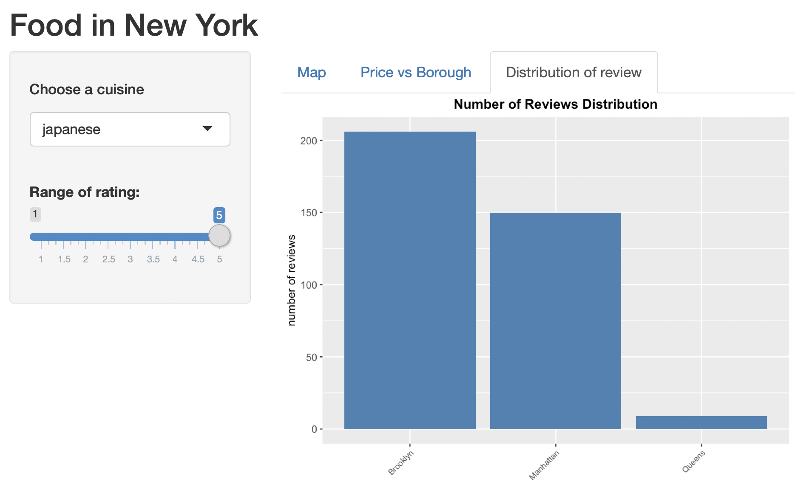

<style type="text/css">

body{ /* Normal  */
      font-size: 14px;
  }
td {  /* Table  */
  font-size: 12px;
}
h1.title {
  font-size: 38px;
}
h1 { /* Header 1 */
  font-size: 28px;
}
h2 { /* Header 2 */
    font-size: 22px;
}
h3 { /* Header 3 */
  font-size: 18px;
  font-family: "Times New Roman", Times, serif;
}
code.r{ /* Code block */
    font-size: 16px;
}
pre { /* Code block - determines code spacing between lines */
    font-size: 14px;
}
</style>

```{r setup, include=FALSE}
knitr::opts_chunk$set(echo = FALSE, warning=FALSE, message = FALSE, fig.align='center')

list.of.packages <- c("ggridges", "tidyverse","dplyr","tidyr",
                      "ggplot2","ggmosaic","productplots","RColorBrewer",
                      "httr","tigris","leaflet","rgdal")

new.packages <- list.of.packages[!(list.of.packages %in% installed.packages()[,"Package"])]
if(length(new.packages)) install.packages(new.packages)

library(ggridges)
library(tidyverse)
library(dplyr)
library(tidyr)
library(ggplot2)
library(ggmosaic)
library(productplots)
library(RColorBrewer)
library(httr)
library(rgdal)
library(shiny)
```

## I. Introduction


## II. About the data source

The data of this project is scraped and converted to csv file in Python from Yelp API's business search endpoint. With the API Key and URL 'https://api.yelp.com/v3/businesses/search', it could be easy to make a request to Yelp API for scrapping and do not need to solve those annoying problems like cookies. 

Because of the maximum limit of Yelp API, the data was scraped twice accroding to the "`category`". Also the paratemer of location is '`New York`'. All the data are originally scrapped except we add one item '`cuisine`' which is also the searching category in scrapping result. What's more, it's important to avoid duplication in the results and it could be easily operated by the `df.drop_duplicates` using `pandas` in Python.

For the purpose that the scrapping results would be more uniform distributed, this project choose five western cuisines and five eastern cuisines that people may be more interested in. In the first file "business_data_western.csv", there are five western cuisines: '`italian`', '`spanish`', '`greek`','`french`', '`mexican`'. In the second file "business_data_eastern.csv", there are five eastern cuisines: '`chinese`', '`korean`', '`japanese`', '`indian`', '`thai`'. There are total 8814 records.  

Here is the [link](https://github.com/zhangyue9966/Final_Project_STAT5293/blob/master/scrape_yelp/scrape_yelp_western.py) of the Python code for getting western restaurants information.

## III. Data cleaning

The original data's dimension is 8814*18. Our steps for data cleaning is shown as below:  

1. Choosed features that would be useful for further analysis: `coordinates`, `cuisine`, `cuisine_type`, `id`, `name`, `price`, `rating`, `review_count`.

2. For missing value, it is only necessary to delete the records containing missing value in the features that we interested. Thus, we deleted records with missing value in `price`, `coordinates`, `rating` and `review_count`. There are total such 351 records.

3. For error values, as there are only two records containing error(false dollar sign), we directly deleted them.

4. Last step is to format data. Firstly, '`price`' is factorred and its levels are resetted. Secondly, as we need '`latitude`' and '`longitude`' to join the dataset with the borough infromation. Thus, we extracted them from '`coordinates`' and created new columns for them, then delete the original '`coordinates`' column. 

Finally, the dataset contains variavles: `latitude`, `longitude`, `name`, `cuisine`, `price`, `rating`, `review_count`, `neighborhood`, `borough`. The counts of each cuisine are shown in the table below.

|Cuisine | Count |
|-------:|-----:|
|French	|550|			
|Greek	|824|			
|Italian	|1000|			
|Mexican	|792|			
|Spanish	|916|			
|Chinese	|884|			
|Indian	|726|			
|Japanese	|535|			
|Korean	|705|			
|Thai	|523|	


```{r}
w_data = read.csv("business_data_western.csv")
w_data = w_data %>% mutate(cuisine_type = "western")
e_data = read.csv("business_data_eastern.csv")
e_data = e_data %>% mutate(cuisine_type = "eastern")

raw_data = rbind(w_data, e_data)
# colnames(raw_data)

df = raw_data %>% 
  select(coordinates,cuisine, cuisine_type, id, name, price, rating, review_count) %>%  
  filter(price != "££" & price != "") %>%   
  mutate(price = factor(price, levels = c("$", "$$", "$$$", "$$$$")))  %>%
  tidyr::separate(data=.,
                      col=coordinates,
                      into=c("latitude", "longitude"),
                      sep=",",
                      remove=TRUE)

# Change the format of coordinates
df$latitude <-  as.numeric(gsub("\\{'latitude':","",df$latitude))
df$longitude <- gsub("\\}","",df$longitude)
df$longitude <- as.numeric(gsub("'longitude': ","",df$longitude))

num_cuisine = df %>% 
  group_by(cuisine) %>%
  summarise(norows = length(cuisine))

```


```{r message=FALSE, warning=FALSE}
# Join neighbourhood with my data
r <- GET("http://data.beta.nyc//dataset/0ff93d2d-90ba-457c-9f7e-39e47bf2ac5f/resource/35dd04fb-81b3-479b-a074-a27a37888ce7/download/d085e2f8d0b54d4590b1e7d1f35594c1pediacitiesnycneighborhoods.geojson")
nyc_neighborhoods <- readOGR(content(r,'text'), 'OGRGeoJSON', verbose = F)
points <- data.frame(lat=df$latitude, lng=df$longitude)
points_spdf <- points
coordinates(points_spdf) <- ~lng + lat
proj4string(points_spdf) <- proj4string(nyc_neighborhoods)
matches <- over(points_spdf, nyc_neighborhoods)
points <- cbind(points, matches)

all_data <- 
  left_join(df, points, by = c("latitude" = "lat", "longitude" = "lng")) %>%
  select(latitude,longitude,name,cuisine,price,rating,review_count,neighborhood,borough)

# write.csv(all_data, file = "all_data.csv")

# colnames(all_data)
```

## IV Analysis of missing values

All the records are independent and most of the data are categorical. Moreover, the missing value is not extensive compared with the whole dataset. Thus, it is not meaningful to use methods like listwise, pairwise or regression to fill up missing valu. In this project, records contaning missing value are deleted directly.

While matching df with the neighbourhood, many unmatched records occured. For dataset all_data, there're 8478 rows and amony them 1010 rows contain missing values. Compared to the total amout of data, we decide to remove these missing data later while ploting.

```{r}
# nrow(all_data)
# sum(is.na(all_data$borough))
# sum(is.na(all_data$neighborhood))
```

## V Results

### What can affect the rating?
Firstly, let's get some insights by looking at the distribution of rating.   

```{r, fig.height = 4, fig.width = 6}
# mean(df$rating)
df0 = df %>% 
  group_by(rating) %>%
  summarise(norows = length(cuisine)) %>%
  mutate(aboveavg = (rating >= 4))

ggplot(df0, aes(x = rating, y = norows, fill = aboveavg)) +
  geom_bar(stat = "identity", position = "identity", colour = "black", size = .25)   + 
  labs(x="Rating", y="Count") +
  ggtitle("Distributions of Ratings")  +
  theme(plot.title = element_text(face = "bold", hjust = 0.5)) + 
  scale_fill_manual(name = "Above Average", values = c("steelblue", "#ee615a")) +
  coord_flip() 
```

The mean of rating is 3.79. Thus, it would be reasonable to consider the restaurants with rating queals to or higher than 4 to be "good" restaurants. They are represented by the red bars in the bar chart. The blue bars represent "bad" restaurants. The distribution of ratings is right-skewed. People tends to give a neutral score, and a few people would give ratings lower than 3.   

### 1. Rating & Price 
The second-level price takes the largest proportion. It also owns the most centralized rating. Overall, The rating present the postive relationship with price. Especially in the higheset-price restaurants, the rating distribution is obviously different with the other levels. There are almost 80% restaurants whose rating are 4 or higher than 4.     
Howerver, outliers exist. In the cheapest restaurants, rating of 4.5 and 5 owns a high proportion. This is reasonable that we must have experienced surprise that some cheap food have the taste which are out of expection. People would give their highese commendation in such situation.

```{r, fig.height = 4, fig.width = 6}
ggplot(df) +
  geom_mosaic(aes(x=product(price), fill=rating)) +
  labs(x="Price", y="Rating")+
  ggtitle("Rating Distribution of Each Price") +
  theme(plot.title = element_text(face = "bold", hjust = 0.5), 
        axis.text.y=element_text(size = 6),
        axis.text.x=element_text(size = 8)) +
  scale_fill_brewer(palette = "Reds") 
```

For further explory, it could be helpfule to add cuisine as a feature. 

### 2. Cuisine & Rating  
Beauser there are nine levels, it would be confusing to using sequential color, instead we used diverging color to show the pattern. What's more, it's better to compare when using `coord_polar` to convert parallel bars into pie chart. The color closer to blue, the higher the rating. The area represents the count.    
It is very clear that italian and korean cusine has the relatively larger proportion of high rating. At the meantime, italian restaurants has the largest amount. Also, there's no distinct difference between western and eastern cuisines.

```{r, fig.height = 4, fig.width = 6}
ggplot(df,aes(cuisine)) +
  geom_bar(aes(fill = as.factor(rating))) +
  coord_polar(theta ="x") +
  scale_fill_brewer(palette = "Spectral") +
  ggtitle("Rating Distribution of Each Cuisine") + 
  theme(plot.title = element_text(face = "bold", hjust = 0.5),
        axis.text.y=element_text(size = 6),
        axis.text.x=element_text(size = 8)) 
```


### 3. Cuisine & Price
Because of less levels, it would be better to use sequential palettes to show the distribution. Darker color represent the higher price. Appreantly, Chinese restaurants has the relatively lowest price while italian restaurants has the highest. While Chinese restaurants do not own the lowest rating, thus, there's no direct relationship between price and rating. This result is consistent with the conclution we drawed before when compared Rating & Price.

```{r, fig.height = 4, fig.width = 6}
ggplot(df,aes(cuisine)) +
  geom_bar(aes(fill = as.factor(price))) +
  coord_polar(theta ="x") +
  scale_fill_brewer(palette = "Reds")

```

### 4. Rating & Review Count  

The box plot clearly show that how much outliers could be of review count. The mean of review count is 270, the median of review count is 153, while the largest review count could be close to 6000. This exposured the high bias in this market. The most focus are on a few popular restaurants. Interestingly, people tends to give review for those low-rate restaurants than high-rate restaurants. People may cannot help expressing anger than happiness.

```{r, fig.height = 4, fig.width = 6}
ggplot(df, aes(x=rating, y=review_count, group=rating)) + 
  geom_boxplot(fill="#ff5c33", outlier.colour = "#ff5c33", alpha = .5) + 
  labs(x="Rating", y="Review Count") +
  ggtitle("Distribution of Review Count by Rating") + 
  theme(plot.title = element_text(face = "bold", hjust = 0.5)) +
  scale_x_continuous(breaks = seq(1,5,.5)) +
  scale_y_continuous(breaks = seq(0,10000,1000)) +
  geom_hline(aes(yintercept=median(df$review_count)), colour="tomato") +
  coord_flip() 
```

## VI Interactive Component

While analyzing data, we found it hard to compare more than 3 elements. So we built R shiny app which contains 3 interavtive parts.

### Is the distribution of restaurant in different cuisine related to borough?

The first interactive part is an interactive map which show the distribution of the location of restaurants given cuisine and rating value. We can explore the distribution change of these restaurants when the cuisine or rating changes. For example, for the most of restaurants in every cuisine, the higher rating is, the closer restaurants are to midtown. This shows that midtown in Manhattan is a great place to dine in if you prefer high rating. 

Unsurprisingly, some cuisine like Chinese restaurants with ratings 4 are located near the China Town area in Mahanttan. However, Itanlian food does not have this trend. From the screenshot below we can see that it's more evenly distributed in Manhattan and do not have specific prefenerce in locations. 





### Will the relationship of price and borough change a lot given differnt cuisine and rating?

Interactive plot give us an opportunity to explore more than 3 elements at the same time. From common sense, we will consider price highly related to borough as the rent for restaurants in Manhanttan will definitely be higher than that in others boroughs. But is this really the case? And what about other boroughs?
From the app we can see that although this result depends on crusine and vary from case to case, for most cuisines the price in Manhattan has more different price level. Especially for Chinese food. 





## Is the number of reviews matters?

Interested in 5 star resaurants only? No problem at all. The plot below is the distribution of number of reviews we would expect for all cuisine. 



But for some cuisines, this is not case for some cuisine like Greek and Spanish. Most of the Greek restaurants with 5 star rating are located in Queens instead of Manhanttan. Janpaness food, however, are located in Brooklyn. From the Price vs Borough we can also find that the price of Japaness restaurant in Brooklyn is not as high as the price in Manhanttan. So we can assume that the price is also an important part which affect the rating.



All data and code documents can be found [here](https://github.com/zhangyue9966/Final_Project_STAT5293). 
Our R shiny app works fine locally, but somehow when we tried to publish it caused problems. We just can't figure out how to solve it. We talked to the professor about this problem and she said it's fine as long as our app can work. Our R shiny app is located at the app.R folder on the GiHub above.


## VII Conclusion

Due to the limit of our access to the data from Yelp, most of our data are discrete variables, which also limit our ways to explore the data.
