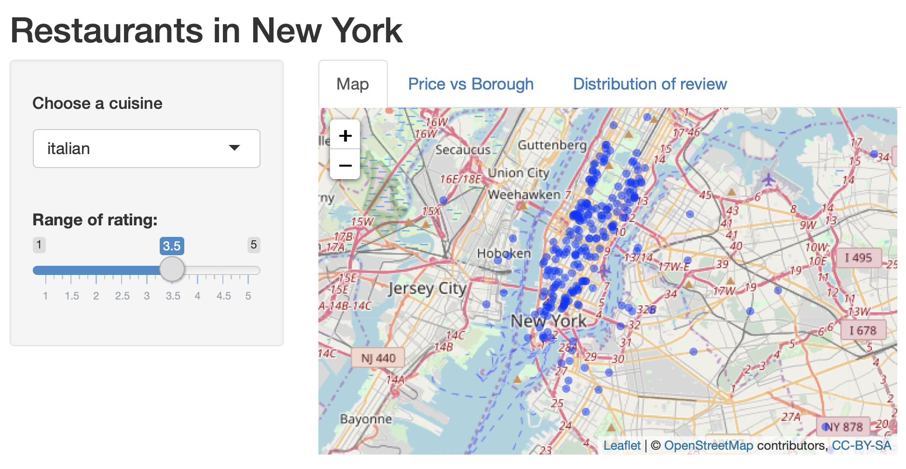
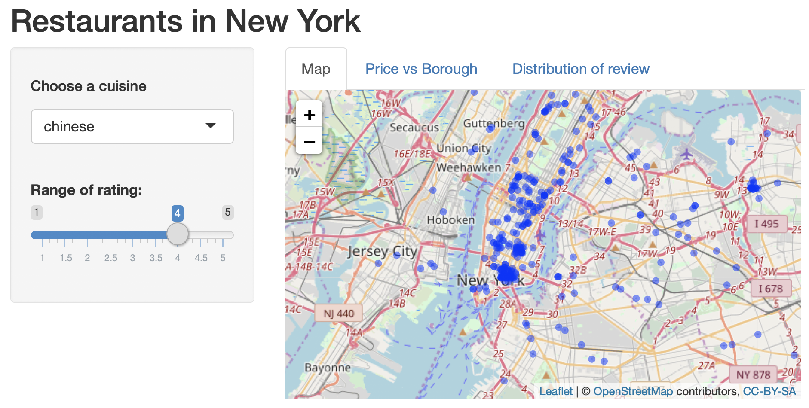
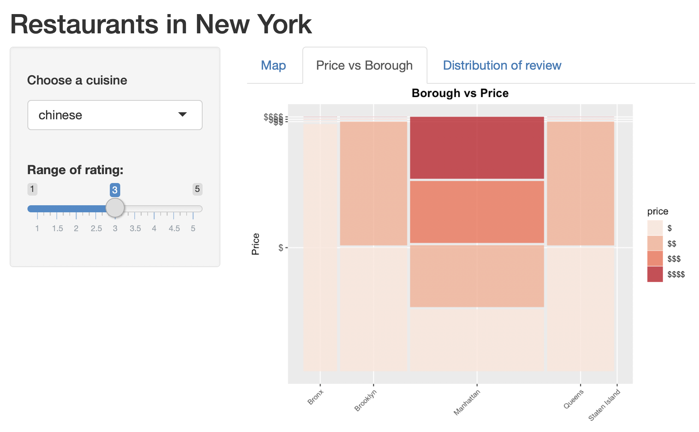
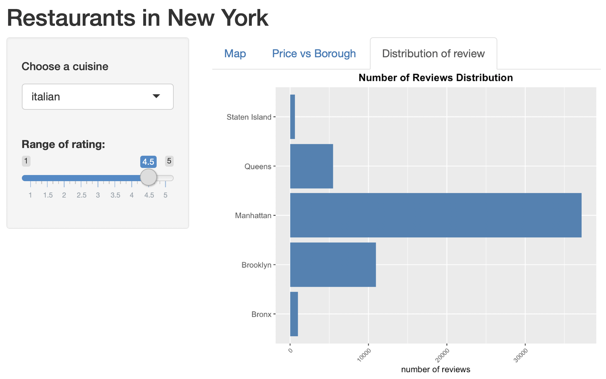
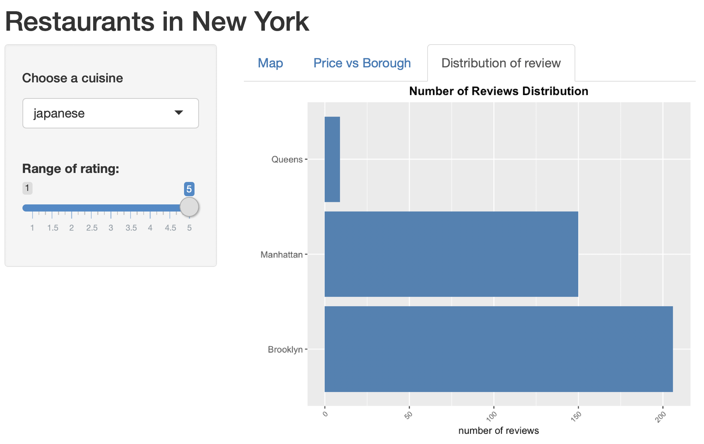

<style type="text/css">

body{ /* Normal  */
      font-size: 14px;
  }
td {  /* Table  */
  font-size: 12px;
}
h1.title {
  font-size: 38px;
}
h1 { /* Header 1 */
  font-size: 28px;
}
h2 { /* Header 2 */
    font-size: 22px;
}
h3 { /* Header 3 */
  font-size: 18px;
  font-family: "Times New Roman", Times, serif;
}
code.r{ /* Code block */
    font-size: 16px;
}
pre { /* Code block - determines code spacing between lines */
    font-size: 14px;
}
</style>

```{r setup, include=FALSE}
knitr::opts_chunk$set(echo = FALSE, warning=FALSE, message = FALSE, fig.align='center')

list.of.packages <- c("ggridges", "tidyverse","dplyr","tidyr",
                      "ggplot2","ggmosaic","productplots","RColorBrewer",
                      "httr","tigris","leaflet","rgdal")

new.packages <- list.of.packages[!(list.of.packages %in% installed.packages()[,"Package"])]
if(length(new.packages)) install.packages(new.packages)

library(ggridges)
library(tidyverse)
library(dplyr)
library(tidyr)
library(ggplot2)
library(ggmosaic)
library(productplots)
library(RColorBrewer)
library(httr)
library(rgdal)
library(shiny)
```

## I. Introduction

New Yrok city is the city combined with many different cultures from all over the world, which indicates the diveristy in people's preference in restaurants. While people's preference in restaurants could be affected by lots of variables like price, cuisine, location, etc. In this project, we explored the data scrapped through Yelp API to answer several questions. What can affect the rating in Yelp? Is the distribution of restaurant in different cuisine related to borough?  Will the relationship of price and borough change a lot given differnt cuisine and rating? Is the number of reviews matters? By looking through this project, we could get some insights of consumer psychology. Customers could find out where is the best place to find their favorite cuisine, etc and merchants may find out some ways to improve their rating in Yelp.

## II. About the data source

Kaiyan Zheng is responsible for collecting the data. The data is scraped and converted to csv file in Python [(This is the code for getting information of western restaurants)](https://github.com/zhangyue9966/Final_Project_STAT5293/blob/master/scrape_yelp/scrape_yelp_western.py) from Yelp API's business search endpoint. With the API Key and [URL](https://api.yelp.com/v3/businesses/search), it would be easy to make a request to Yelp API for scrapping and do not need to solve those annoying problems like cookies. 

There is another option to collect Yelp data, which is downloaded the whole dataset which is provided by Yelp. However, this dataset is mainly used for Kaggle competition and we are supposed to obtain primary data. Also, it would be more effective to scrape data from Yelp API directly because we can select the variables we need without downing the data in GBs.

Because of the maximum limit of Yelp API, the data was scraped twice accroding to the "`category`". Also the paratemer of location is '`New York`'. All the data are originally scrapped except we add one item '`cuisine`' which is also the searching category in scrapping result. What's more, it's important to avoid duplication in the results and it could be easily operated by the `df.drop_duplicates` using `pandas` in Python.

For the purpose that the scrapping results would be more uniform distributed, this project choosed five western cuisines and five eastern cuisines that people may be more interested in. In the first file "business_data_western.csv", there are five western cuisines: '`italian`', '`spanish`', '`greek`','`french`', '`mexican`'. In the second file "business_data_eastern.csv", there are five eastern cuisines: '`chinese`', '`korean`', '`japanese`', '`indian`', '`thai`'. There are total 8814 records. Below are the information of variables.

|Variable | Type | Example |
|-------|-----|-----|
|alias  |Categorical | trattoria-trecolori-new-york|
|categories |Categorical  | [{'alias': 'italian', 'title': 'Italian'}]|
|coordinates |Continuous  | {'latitude': 40.75998, 'longitude': -73.98671}|
|cuisine      |Categorical |italian |
|display_phone|Categorical |(212) 997-4540|
|distance     |Continuous  |699.3573 |
|id           |Categorical  |"DoSU8IPq-Py_YV3kYmXPfQ"|
|image_url    |Categorical |https://s3-media4.fl.yelpcdn.com/bphoto/G8vBgHxbEfoONO0JpLX3Qw/o.jpg |
|is_closed    |Logical | "False" |
|location     |Categorical | {'address1': '254 West 47th St', 'address2': '', 'address3': '', 'city': 'New York', 'zip_code': '10036', 'country': 'US', 'state': 'NY', 'display_address': ['254 West 47th St', 'New York, NY 10036']}	|
|name         |Catrgorical | Trattoria Trecolori|
|phone        |Continuous | 12129974540 |
|price        |Catrgorical |\$$|
|rating       |Catrgorical |  4.0 |
|review_count |Continuous| 2071 |
|transactions |Catrgorical| ['delivery', 'restaurant_reservation', 'pickup'] |
|url         |Catrgorical |https://www.yelp.com/biz/trattoria-trecolori-new-york?adjust_creative=3AfbwyHTrzK_p13s2OO9fw&utm_campaign=yelp_api_v3&utm_medium=api_v3_business_search&utm_source=3AfbwyHTrzK_p13s2OO9fw	| 


## III. Data cleaning

We directly imported csv file into R for data cleaning. The original data's dimension is 8814*18. Our steps for data cleaning is shown as below:  

1. Choosed features that would be useful for further analysis: `coordinates`, `cuisine`, `cuisine_type`, `id`, `name`, `price`, `rating`, `review_count`.

2. For missing value, it is only necessary to delete the records containing missing value in the features that we interested. Thus, we deleted records with missing value in `price`, `coordinates`, `rating` and `review_count`. There are 351 such records in total.

3. For error values, as there are only two records containing error(false dollar sign), we directly deleted them.

4. Last step is to format data. Firstly, '`price`' is factorred and its levels are resetted. Secondly, as we need '`latitude`' and '`longitude`' to join the dataset with the borough infromation. Thus, we extracted them from '`coordinates`' and created new columns for them, then delete the original '`coordinates`' column. 

Finally, the dataset contains variables: `latitude`, `longitude`, `name`, `cuisine`, `price`, `rating`, `review_count`, `neighborhood`, `borough`. The number of restaurants in each cuisine are shown in the table below.

|Cuisine | Count |
|-------|-----|
|French	|550|			
|Greek	|824|			
|Italian	|1000|			
|Mexican	|792|			
|Spanish	|916|			
|Chinese	|884|			
|Indian	|726|			
|Japanese	|535|			
|Korean	|705|			
|Thai	|523|	


```{r}
w_data = read.csv("business_data_western.csv")
w_data = w_data %>% mutate(cuisine_type = "western")
e_data = read.csv("business_data_eastern.csv")
e_data = e_data %>% mutate(cuisine_type = "eastern")

raw_data = rbind(w_data, e_data)
# colnames(raw_data)

df = raw_data %>% 
  select(coordinates,cuisine, cuisine_type, id, name, price, rating, review_count) %>%  
  filter(price != "££" & price != "") %>%   
  mutate(price = factor(price, levels = c("$", "$$", "$$$", "$$$$")))  %>%
  tidyr::separate(data=.,
                      col=coordinates,
                      into=c("latitude", "longitude"),
                      sep=",",
                      remove=TRUE)

# Change the format of coordinates
df$latitude <-  as.numeric(gsub("\\{'latitude':","",df$latitude))
df$longitude <- gsub("\\}","",df$longitude)
df$longitude <- as.numeric(gsub("'longitude': ","",df$longitude))

num_cuisine = df %>% 
  group_by(cuisine) %>%
  summarise(norows = length(cuisine))

```


```{r message=FALSE, warning=FALSE}
# Join neighbourhood with our data
r <- GET("http://data.beta.nyc//dataset/0ff93d2d-90ba-457c-9f7e-39e47bf2ac5f/resource/35dd04fb-81b3-479b-a074-a27a37888ce7/download/d085e2f8d0b54d4590b1e7d1f35594c1pediacitiesnycneighborhoods.geojson")
nyc_neighborhoods <- readOGR(content(r,'text'), 'OGRGeoJSON', verbose = F)
points <- data.frame(lat=df$latitude, lng=df$longitude)
points_spdf <- points
coordinates(points_spdf) <- ~lng + lat
proj4string(points_spdf) <- proj4string(nyc_neighborhoods)
matches <- over(points_spdf, nyc_neighborhoods)
points <- cbind(points, matches)

all_data <- 
  left_join(df, points, by = c("latitude" = "lat", "longitude" = "lng")) %>%
  select(latitude,longitude,name,cuisine,price,rating,review_count,neighborhood,borough)

# write.csv(all_data, file = "all_data.csv")

# colnames(all_data)
```

## IV Analysis of missing values

All the records are independent and most of our data are categorical and the missing value is not extensive compared with the whole dataset. Thus, it is not meaningful to use methods like listwise, pairwise or regression to fill up missing value. In our dataset for analysis, records contaning missing value are deleted directly.

As we can't get borough informatin of each restaurant directly from Yelp, we need to join the coordinates in our dataset with another dataset, which give us the borough and coordiantes. Many unmatched records occured while merging these 2 dataset. For dataset all_data, there're 8478 rows. Among them 1010 rows contain missing values. Compared to the total amout of data, we decide to remove these missing data later while ploting.

```{r}
# nrow(all_data)
# sum(is.na(all_data$borough))
# sum(is.na(all_data$neighborhood))
```

## V Results

### What can affect the rating?

Firstly, let's get some insights by looking at the distribution of rating.   

```{r, fig.height = 4, fig.width = 6}
# mean(df$rating)
df0 = df %>% 
  group_by(rating) %>%
  summarise(norows = length(cuisine)) %>%
  mutate(aboveavg = (rating >= 4))

ggplot(df0, aes(x = rating, y = norows, fill = aboveavg)) +
  geom_bar(stat = "identity", position = "identity", colour = "black", size = .25)   + 
  labs(x="Rating", y="Count") +
  ggtitle("Distributions of Ratings")  +
  theme(plot.title = element_text(face = "bold", hjust = 0.5)) + 
  scale_fill_manual(name = "Above Average", values = c("steelblue", "#ee615a")) +
  coord_flip() 
```

The mean of ratings is 3.79. Thus, it would be reasonable to consider the restaurants with rating equals to or higher than 4 to be "good" restaurants. They are represented by the red bars in the bar chart. The blue bars represent "bad" restaurants. We can se from the plot that the distribution of ratings is right-skewed, whcih means people tends to give a neutral score, and a few people would give ratings lower than 3.   

### 1. Rating & Price 

The second-level price takes the largest proportion. It also owns the most centralized rating. Overall, The rating present the postive relationship with price. Especially in the higheset-price restaurants, the rating distribution is obviously different with the other levels. There are almost 80% restaurants whose rating are 4 or higher than 4.     
However, outliers exist. In the cheapest restaurants, rating of 4.5 and 5 owns a high proportion. This is reasonable as we must have experienced surprise while eating in cheap restaurant and the taste are higher than our expection. People would give their highest rcommendation in such situation.

```{r, fig.height = 4, fig.width = 6}
ggplot(df) +
  geom_mosaic(aes(x=product(price), fill=rating)) +
  labs(x="Price", y="Rating")+
  ggtitle("Rating Distribution of Each Price") +
  theme(plot.title = element_text(face = "bold", hjust = 0.5), 
        axis.text.y=element_text(size = 6),
        axis.text.x=element_text(size = 8)) +
  scale_fill_brewer(palette = "Reds") 
```

For further exploration, it could be helpfule to add cuisine as a feature. 

### 2. Cuisine & Rating  

Because there are nine levels in rating, it would be confusing to use sequential color. Instead we used diverging color to show the pattern. What's more, it's better to compare when using `coord_polar` to convert parallel bars into pie chart. The color closer to blue, the higher the rating. The area represents the count.    
It is very clear that Italian and Korean cusine has relatively larger proportion of high rating. At the meantime, Italian restaurants has the largest amount. Also, there's no difference between western and eastern cuisines.

```{r, fig.height = 4, fig.width = 6}
ggplot(df,aes(cuisine)) +
  geom_bar(aes(fill = as.factor(rating))) +
  coord_polar(theta ="x") +
  scale_fill_brewer(palette = "Spectral") +
  ggtitle("Rating Distribution of Each Cuisine") + 
  theme(plot.title = element_text(face = "bold", hjust = 0.5),
        axis.text.y=element_text(size = 6),
        axis.text.x=element_text(size = 8)) 
```


### 3. Cuisine & Price

Because the price variable contains only 4 levels, it would be better to use sequential palettes to show the distribution. Darker color represents the higher price. Apparently, Chinese restaurants have the relatively lower price while Italian restaurants has the highest. While Chinese restaurants do not own the lowest rating, thus, there's no direct relationship between price and rating. This result is consistent with the conclusion we drawed before when comparing rating & price.

```{r, fig.height = 4, fig.width = 6}
ggplot(df,aes(cuisine)) +
  geom_bar(aes(fill = as.factor(price))) +
  coord_polar(theta ="x") +
  scale_fill_brewer(palette = "Reds")

```

### 4. Rating & Review Count  

The box plot clearly show how much outliers could be of review count. The mean of review count is 270, the median of review count is 153, while the largest review count could be close to 6000. This exposed the high bias in this market. The most focus are on a few popular restaurants. Interestingly, people tends to give review for those low-rate restaurants than high-rate restaurants. People may cannot help expressing anger than happiness. 

```{r, fig.height = 4, fig.width = 6}
ggplot(df, aes(x=rating, y=review_count, group=rating)) + 
  geom_boxplot(fill="#ff5c33", outlier.colour = "#ff5c33", alpha = .5) + 
  labs(x="Rating", y="Review Count") +
  ggtitle("Distribution of Review Count by Rating") + 
  theme(plot.title = element_text(face = "bold", hjust = 0.5)) +
  scale_x_continuous(breaks = seq(1,5,.5)) +
  scale_y_continuous(breaks = seq(0,10000,1000)) +
  geom_hline(aes(yintercept=median(df$review_count)), colour="tomato") +
  coord_flip() 
```

## VI Interactive Component

While analyzing data, we found it hard to compare more than 3 elements. So we built R shiny app which contains 3 interactive parts.

### 1. Is the distribution of restaurants in different cuisine related to borough?

The first interactive part is an interactive map which show the distribution of the location of restaurants given cuisine and rating value. We can explore the distribution change of these restaurants when the cuisine or rating changes. For example, for most of restaurants in every cuisine the higher rating is, the closer restaurants are to midtown. This shows that midtown in Manhattan is a great place to dine in if you prefer higher rating. 

Unsurprisingly, some cuisine like Chinese restaurants with ratings 4 are located near the China Town area in Mahanttan. However, Itanlian food does not have this trend. From the screenshot below we can see that it's more evenly distributed in Manhattan and do not have specific prefenerce in locations. 

<p align="center">
  
</p>

<p align="center">
  
</p>


### 2. Will the relationship of price and borough change a lot given differnt cuisine and rating?

Interactive plot give us an opportunity to explore more than 3 elements at the same time. From common sense, we will consider price highly related to borough as the rent for restaurants in Manhanttan will definitely be higher than that in others boroughs. But is this really the case? And what about other boroughs?
From the app we can see that although this result depends on crusine and vary from case to case, for most cuisines the price in Manhattan has more different price level. Especially for Chinese food. 

<p align="center">
  
</p>

<p align="center">
  
</p>


### 3. Is the number of reviews matters?

Interested in 5 star resaurants only? No problem at all. The plot below is the distribution of number of reviews we would expect for all cuisine. 

<p align="center">
  
</p>


But for some cuisines, this is not case for some cuisine like Greek and Spanish. Most of the Greek restaurants with 5 star rating are located in Queens instead of Manhanttan. Most 5 start Janpaness restaurants, however, are located in Brooklyn. From the Price vs Borough tab on app.R we can also find that the price of Japaness restaurant in Brooklyn is not as high as the price in Manhanttan which might bring more customers to them. So we can assume that the price is also an important part which affect the rating

<p align="center">
  
</p>


All data and code documents can be found [here](https://github.com/zhangyue9966/Final_Project_STAT5293). 

Our R shiny app works fine locally, but somehow when we tried to publish it caused problems. We just can't figure out how to solve it. We talked to the professor about this problem and she said it's fine as long as our app can work. Our R shiny app is located at the app.R folder on the GiHub above.


## VII Conclusion

In this project, we performs explorative data analysis on data scrapped through Yelp API. We explored the relationship among borough, rating, cuisine, price and number of reviews.

### Limitation

1. The data could be accessed from Yelp API is limited. Most of our variables are discrete which restrict ways to explore. Thus, most of our plots are barcharts or mosaic plots as we have many discrete variables. 

2. This project mainly focus on data explory. However, there might be more business value could be explored except from what have been found.

### Futhre directions

1. It would be useful to seek more information like scrapping data directly from Yelp to get more continuous data like date in order to analyze the change of customers preference with different generation. Or getting reviews on Yelp to use wordcloud and n-gram clustering for finding more components which affect the rating of the restaurants.

2. It is possible or even productive to make a detailed report for customoers and merchants. As the resultes we've got. Customers could find out where is the best place to find their favorite cuisine, where can find some cheap but high-quality food, etc. Merchants may find out what's are more important to the rating, what's the features of different cuisine. With such information, merchants could make better strategy.

### lessons learned

1. Though intuition is important, it should be discarded when we are exploring data. In the process of exploring data, we found that the facts presented are always not the same of what we might thought of before. For example, restaurants with low price may have high proportion of high rating. To explore those hidden fact, intuition might make a lot of confusion while we are supposed to spend more time finding the cause behind the data.

2. Choosing the right graph to present data is important. As the most of our variables are catrgorical data, we are not able to choose ways like densinty plot to see the trend easily. The data could be meaningless if we choose the wrong plots. However, with the right plots, data becomes valuable.
